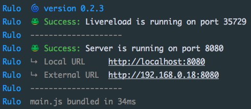

# :cyclone: rulo
### A minimal dev server for Rollup, heavily based on [budo](https://github.com/mattdesl/budo/)

[](https://greenkeeper.io/)

[](https://ci.appveyor.com/project/pqml/rulo/branch/master)
[](https://travis-ci.org/pqml/rulo)

<br>




<br>
<h1></h1>
<br>

### :warning: Work in progress! :warning:
If you want nice & stable dev server, fully tested, use [budo](https://github.com/mattdesl/budo/)

<br>
<h1></h1>
<br>


### :inbox_tray: Requirements & Installation

#### Requirements
- Node version >= 4
- npm version >= 2

#### CLI installation

###### Via global npm installation
```sh
npm install -g pqml/rulo
```


###### Via local npm installation
```sh
npm install pqml/rulo
```

<br>
<h1></h1>
<br>

### :muscle: Usage

* [Javascript API](https://github.com/pqml/rulo/blob/master/docs/api-usage.md)
* [Command Line](https://github.com/pqml/rulo/blob/master/docs/cli-usage.md)

<br>
<h1></h1>
<br>

### :memo: Todo

- Test a lot more

<br>
<h1></h1>
<br>

### :page_with_curl:  License
MIT.

<br><br>